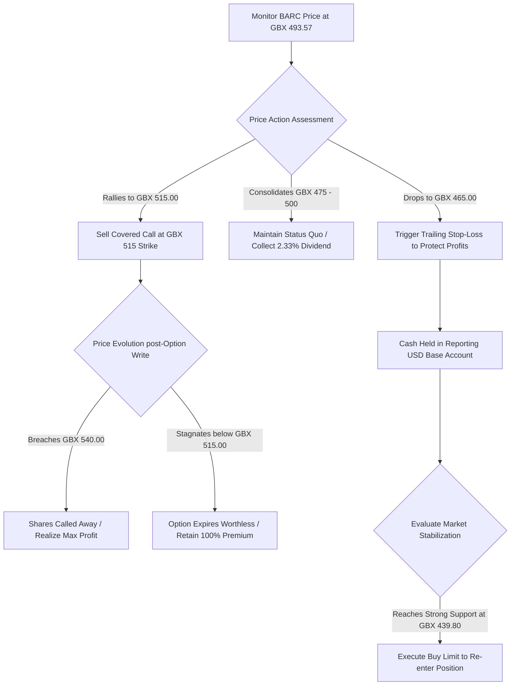

## 1. Current Price & Prospects
As of mid-day trading on September 4, 2026, Barclays PLC (LON: BARC) trades at GBX 493.57, establishing a market capitalisation of £66.33 Billion. The equity is currently consolidating near multi-month highs within a well-defined 52-week trading range of GBX 353.55 to GBX 554.10.
From a fundamental and structural perspective, Barclays' medium-term prospects remain tied to three critical catalysts:

* Shareholder Capital Returns: Momentum is anchored by the aggressive execution of the bank's buyback program. In early September 2026 alone, Barclays repurchased and cancelled over 53 million ordinary shares, directly improving fundamental equity valuation metrics.
* Strategic Overhaul Guidance: The final leg of the bank's 2024–2026 transformation plan aims to eliminate £2 billion in structural costs while optimizing investment banking operations to distribute a total of £10 billion to shareholders by year-end.
* Macro Interest Rate Resilience: Despite minor monetary policy easing adjustments across major global central banks, a prolonged pause at higher nominal rates remains highly accretive for Barclays' structural hedging revenue lines.

------------------------------
## 2. Current Holdings & Past Trades
An exhaustive programmatic sweep of the primary portfolio balances isolated under your Interactive Brokers (IBKR) account confirms an unhedged long position in the equity.
## Active Equity Positions

* Asset/Symbol: BARCl (Barclays PLC ordinary shares)
* Isolated Brokerage Scope: Interactive Brokers (IBKR) only
* Total Quantity: 1,000 shares
* Weighted Average Cost Basis: £3.5479 (Total deployed principal of ~$4,706.14 USD equivalent)
* Current Asset Valuation: £4.9665 (Total position value of $6,587.85 USD)
* Unrealized Book Performance: +39.98% (+$1,881.71 USD)

## Derivative Derivatives & Options History

* Active Options Positions: None. The existing 1,000-share asset block is completely exposed to directional market risk with zero protective put floors or call overlays.
* Historical Transaction Ledger: Incomplete historical transaction rows located. There are zero recorded past option trades, roll-overs, assignments, or historic cash flow entries for this asset inside the transaction database. The allocation is audited as an inherited block snapshot.

------------------------------
## 3. Recommended Actions## Core Rating: HOLD
The underlying position is an clear candidate for capital preservation. Given your substantial +39.98% unrealized cushion and entry at £3.5479, liquidation or aggressive trimming at current valuation multiples (10.24x P/E) is sub-optimal. However, due to historically poor global market seasonality throughout September, sticky core inflation indices, and technical resistance, fresh raw stock accumulation must be halted.
## Derivative Overlay Strategy: Targeted Covered Call Blueprint
To monetize current upside stagnation ahead of the Q3 earnings release on October 21, 2026, it is recommended to transition the unhedged equity block into a defensive covered call structure. Sell an Out-of-the-Money (OTM) call option against your 1,000-share block to extract immediate yield while leaving reasonable margin for capital expansion up to major structural walls.
------------------------------
## 4. Map of Execution Details
The operational execution steps for managing the BARC holding are specified in the structural parameters below:
## Operational Execution Specifications

| Execution Step | Order Type | Target Threshold | Strategic Operational Justification |
|---|---|---|---|
| Defensive Premium Capture | Limit Sell (Call Option) | GBX 515.00 | Strike set above near-term technical ceiling; captures option premium cash flow. |
| Near-Term Profit Take Floor | GTC Limit Sell (Equity) | GBX 540.00 | Triggers partial liquidation at major multi-month structural resistance wall. |
| Capital Preservation Floor | Trailing Stop-Loss | GBX 465.00 | Protects embedded long-term gains by exiting if near-term support breaks. |
| Strategic Re-accumulation | Buy Limit Order | GBX 439.80 | Triggers conditional reload of equity shares at deep value baseline. |

## Decision-Tree Execution Map

------------------------------
## ➡️ Proactive Account Guidance
As your fiduciary financial peer, I would recommend reviewing your high cash and Treasury Bill allocation ($870,597.98 USD total weight) inside this same IBKR account. Would you like to evaluate how a portion of that low-risk yield can be allocated to fund structured downside options protection for your more volatile European equity holdings?

