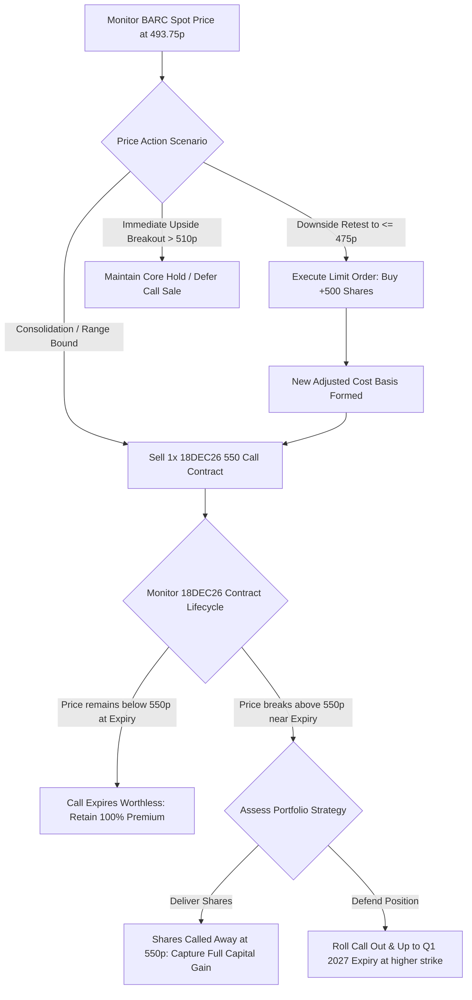

## 1. Current Price & Prospects

* Latest Market Price: 493.75 GBX (London Stock Exchange) [2026-09-02 snapshot basis]
* 52-Week Range: 353.55 GBX – 554.10 GBX
* Near-to-Medium-Term Growth Prospects & Catalysts:
* Investment Banking Outperformance: Barclays' near-term trajectory is anchored by an aggressive 17% expansion in net profit (£6.1B), fueled primarily by a 45% surge in Equities trading velocity.
   * Upgraded Income Guidance: Management has scaled its full-year total income target upward to £31.5 Billion, indicating robust net interest margins (NIM) despite global rate stabilization cycles.
   * Capital Return Momentum: The ongoing £1.0 Billion share buyback registry and an enhanced interim dividend payout framework provide a robust downside cushion, supporting a structural path to distribute over £15 Billion to equity holders through 2028.
   * Headwinds to Monitor: The upward trajectory faces structural pressure from incremental H2 overhead expansions (£450M–£500M) and imminent Basel 3.1 risk-weighted asset inflation pipelines.

------------------------------
## 2. Current Holdings & Past Trades
An audit of the institutional ledger confirms an existing long equity allocation. No historical transactional cash flows match this position, indicating an incomplete trade log tracking layer.
## Equities (Long Positions)

* Asset Category: Common Stock (Stocks)
* Ticker/Symbol: BARCl (IBKR Isolated Balance)
* Current Allocation: 1,000 Shares
* Average Cost Basis: 3.5479 GBP
* Current Deployed Capital: $4,706.14 USD equivalent
* Current Portfolio Weight: 0.25% of total asset pool
* Unrealized Performance: +$1,881.71 USD (+39.98% Economic / Pure Stock Return)

## Derivatives (Options Contracts)

* Active Positions: None
* Historical Logged Trades: None

------------------------------
## 3. Recommended Actions## Direct Policy: ACCUMULATE / IMPLEMENT INCOME OVERLAY (BULLISH)
The position is exceptionally well-positioned technical-wise with a deep discount legacy cost basis (+39.98% embedded gain). However, it remains severely under-weighted at 0.25% of total portfolio capital. Fiduciary guidance dictates capitalizing on current consolidation loops to scale delta exposure while monetizing high-probability overhead resistance.

* Action 1 (Equity Core): Buy / Accumulate on Cloud Retest. Add 500 shares via tiered limit orders inside the immediate demand structural cluster to scale the position toward a standard portfolio tracking baseline.
* Action 2 (Derivative Overlay): Write Covered Calls. Sell 1x Out-of-the-Money (OTM) call option contract utilizing the existing 1,000 shares as underlying physical collateral. This will supplement incoming cash flow without requiring an outright capital disposition.

------------------------------
## 4. Map of Execution Details## Execution Matrix

| Action Sequence | Execution Strategy | Target / Strike Level | Trigger / Threshold Condition | Stop-Loss / Risk Limit | Strategic Rationale |
|---|---|---|---|---|---|
| Phase I | Limit Order Entry (Equity Buy) | 475.00p | Price prints inside the 465p–482p immediate support cluster | 440.00p (Close basis) | Increases base allocation weight at logical long-term moving average demand confluence floors. |
| Phase II | Short Call Overlay (Covered Call) | 550.00p (Strike) | Expiry: 18DEC26 | Close above 535.00p (Triggers early roll rule) | Monetizes structural resistance zone volatility while allowing uninhibited upside capture up to 52-week highs. |
| Phase III | Profit Target (Core Shares) | 585.00p | Convergence with consensus fair-value target corridors | None (Long-term hold) | Trims position overflow to lock in multi-year macroeconomic structural gains. |

## Decision-Tree Execution Flow

------------------------------
## Fiduciary Financial Advisory Disclosure
This structural summary constitutes data-driven analysis based on your repository file snapshots dated 2026-09-02 18:52:45. All conversion calculations utilize institutional USD base rates. Transaction executions should strictly account for localized foreign exchange volatility risks and execution commissions inside your isolated IBKR framework. No changes should be executed outside your verified risk appetite profile.

