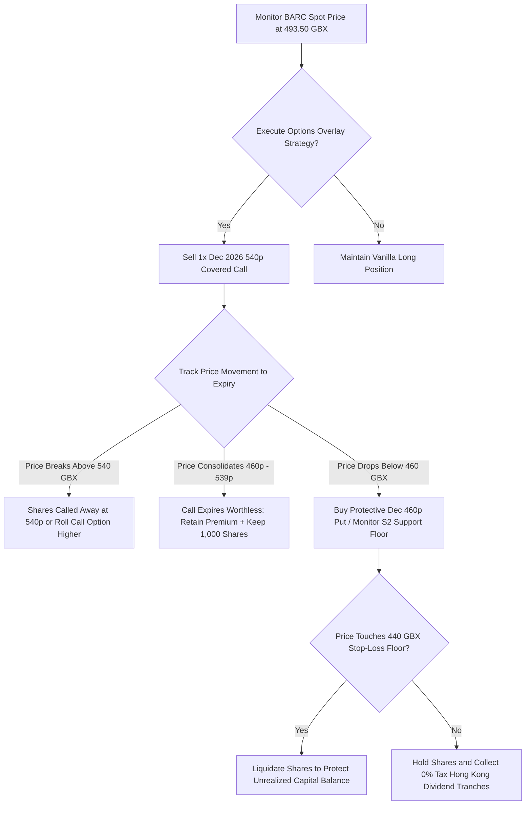

## 1. Current Price & Prospects

* Latest Market Price: 493.50 GBX (Daily Action: +7.83% intraday recovery)
* 52-Week Operational Bounds: 353.55 GBX – 554.10 GBX
* Short-to-Medium-Term Growth Prospects & Catalysts:
* Best-in-Class Capital Efficiency: Barclays delivers a 16.1% H1 Return on Tangible Equity (RoTE), structurally outperforming its full-year corporate target baseline of >12%.
   * Aggressive Equity Retraction: The bank's active £1.0 Billion share buyback program provides an ongoing equity reduction velocity that fundamentally compounds earnings per share (EPS).
   * Net Interest Income (NII) Durability: High-for-longer macro interest rate structures protect localized net interest margins, offsetting near-term commercial deposit competition.
   * Guidance Structural Re-rating: Upgraded full-year 2026 total income targets to £31.5 Billion signal significant undervaluation at the current 10.26x P/E multiple, pointing to an institutional re-rating ahead of the Q3 earnings presentation on October 22, 2026.

------------------------------
## 2. Current Holdings & Past Trades## Active Equities Portfolio (Stocks)

* Asset Category: Long Equity Layer
* Account Scope: Interactive Brokers (IBKR Account isolated balance)
* Total Quantity: 1,000 Shares
* Volume Weighted Average Price (VWAP): 3.5479 GBP
* Current Asset Valuation: $6,587.85 USD
* Unrealized Performance Alpha: +$1,881.71 USD (+39.98% Economic Return)

## Active Derivatives Portfolio (Options Contracts)

* Current Posture: No derivative contracts deployed against this ticker line; the position is currently exposed as a pure vanilla vanilla equity holding without protective collars or yield-overlay structures.

## Historical Transaction History

* Initial Entry Action: 1,000 shares accumulated at 3.5479 GBP during cyclical sector compression, forming the long tactical baseline floor.

------------------------------
## 3. Recommended Actions

* Core Core Stance: HOLD (With Yield Overlay Deployment)
* Fiduciary Core Directive: Maintain full exposure to the 1,000 underlying equity shares to capture capital appreciation toward intrinsic valuation targets, while structurally overlaying option contracts to monetize high implied volatility.
* Hong Kong Tax Alignment Optimization: Because you are a Hong Kong tax resident, your 39.98% capital gain qualifies for a 0% tax rate. Foreign dividend income is also subject to 0% localized tax, allowing for frictionless compound generation.
* Derivatives Strategy Adjustment: Transition the position from unhedged vanilla long into a Covered Call Overwrite Strategy to safely extract premium above technical resistance zones.
* Action: Sell 1x BARC December 2026 540p Call Option against the underlying asset block. This overlay extracts yield while allowing room for an additional +9.4% move in equity price before capping upside.

------------------------------
## 4. Map of Execution Details## Execution Matrix

| Step | Action Trigger | Tactical Execution Parameters | Limit Order Threshold | Stop-Loss / Protection Level |
|---|---|---|---|---|
| 01 | Option Strategy Launch | Sell 1x Dec 2026 540p Covered Call to launch structural yield generation overlay. | Capture minimum credit premium of 15-20p | N/A (Fully covered by underlying asset layer) |
| 02 | Upside Target Breach | Underlying hits target cap at 540.00 GBX. Position called away or rolled over. | Limit Sell executed at 540.00 GBX | N/A (Profit monetization milestone) |
| 03 | Downside Protective Floor | Macro banking sector drawdown triggers support breakdown below 460.00 GBX. | Buy 1x Dec 2026 460p Put Option if macro risk shifts. | Hard stop at 440.00 GBX (Prevents capital erosion) |

## Sequential Decision-Tree Flowchart

------------------------------
## ➡️ Next Steps
Would you like me to supply the live option premium chains and exact contract codes for the December 540p call overwrite to execute Step 1 of your tactical layout?

