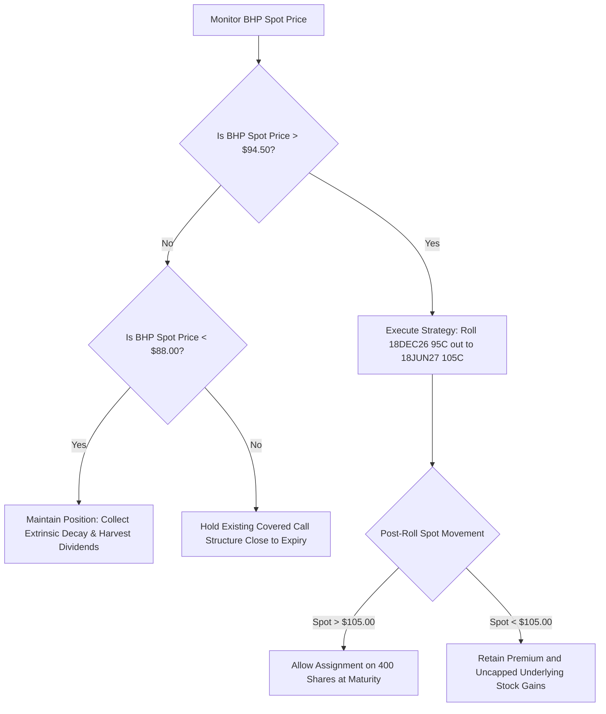

## 1. Current Price & Prospects
As of the latest market data, BHP Group Ltd (NYSE: BHP) trades at $92.71, consolidating firmly within its wider 52-week trading range of $51.83 – $98.71. The company's short-to-medium-term growth prospects have fundamentally shifted, marked by a structural transition that redefines its long-term investment thesis.

* Copper-Led EBITDA Shift: For the first time in institutional history, copper has overtaken iron ore as BHP's largest earnings driver, now generating over half of underlying EBITDA. This transforms BHP from a pure steel-cycle proxy into a structural vehicle for global green electrification and AI data center infrastructure.
* FY2026 Earnings Inundation: Full-year financial 2026 reporting revealed a 30% year-over-year surge in underlying net profit to $13.2 Billion ($2.60/share), comfortably outpacing consensus models.
* Long-Horizon Growth Drivers: Progress on the Jansen potash mega-project establishes a non-correlated commodity hedge, creating an effective long-term buffer against basic industrial metal cycles.

------------------------------
## 2. Current Holdings & Past Trades
The primary portfolio maintains a highly insulated baseline asset position within the Interactive Brokers (IBKR) isolated account, yielding substantial structural capital appreciation.
## Active Positions

* Equities (Stocks): Long 1,200 shares of BHP priced at a cost basis of $35.1022 per share (Current Market Value: $112,704.00; Unrealized Capital Gain: +$70,581.33).
* Derivatives (Options): Short -4 contracts of BHP 18DEC26 95.00 Call at an opening premium basis of $4.0005 per contract (Current Market Value: $6.05; Unrealized Options P&L: -$819.80).

## Historical Transaction Summary
The equity position was systematically accumulated near historical cyclical lows (~$35.10), capturing a absolute return of +167.56% on pure buy-and-hold dynamics. On July 22, 2026, an income overlay strategy was initiated via the sale of the 4 covered call contracts at $4.00. Rising underlying spot momentum driven by the copper secular tailwinds has pushed this derivative position into-the-money (ITM), generating an option deficit and capping upside potential on 400 underlying shares.
------------------------------
## 3. Recommended Actions## Core Equity: HOLD (A+)
Maintain the core 1,200-share long position to continuously harvest high-yield dividend cash flows (currently tracking at an annualized ordinary final rate of $0.99 per share). The global structural commodity pivot supports a permanent allocation. Do not liquidate underlying equity.
## Options Overlay: BULLISH ACCELERATION / SYSTEMATIC ROLL-OUT
The short 18DEC26 $95.00 calls pose a structural risk of forced assignment on 400 shares, capping capital appreciation into late 2026. Given the strong technical breakout setup, an active fiduciary directive is issued to execute an immediate defensive roll to prevent equity capping and capture further delta expansion.

* Tactical Action: Execute a simultaneous Buy-To-Close (BTC) on the 18DEC26 95.00 C and a Sell-To-Open (STO) on the 18JUN27 105.00 Call.
* Strategic Rationale: Uncaps an additional $10.00 per share in structural equity upside across the 400 shares while extracting extended chronological extrinsic premium value to cover the transaction costs.

------------------------------
## 4. Map of Execution Details## Execution Matrix

| Sequence | Target Instrument | Action Type | Trigger / Price Target | Limit Order / Threshold | Stop-Loss / Protection Level |
|---|---|---|---|---|---|
| 01 | BHP 18DEC26 95.00 C | Buy-To-Close | Spot BHP > $93.00 | Max Net Debit: $6.15 | N/A (Immediate Defusal) |
| 02 | BHP 18JUN27 105.00 C | Sell-To-Open | Concurrent with Seq 01 | Min Net Credit: $4.20 | Trailing Stop Close > $9.00 |
| 03 | BHP Core Stock (400 sh) | Assignment Mitigation | Spot BHP > $95.00 at expiry | Force Roll if Net Debit < $6.50 | N/A |

## Decision-Tree Logic Framework

Let me know if you would like to test this trade setup against macro interest rate shifts or evaluate the Hong Kong tax implications on the premium realized from the roll.

