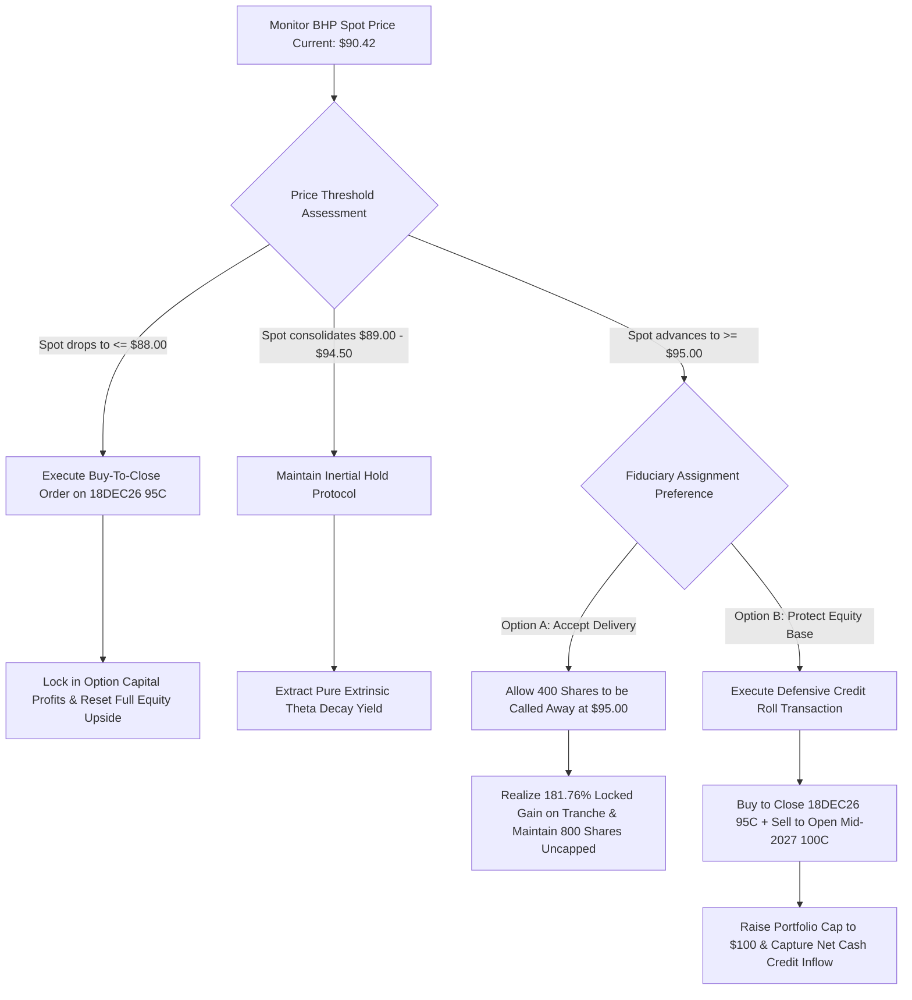

## 1. Current Price & Prospects

* Market Pricing: BHP Group Limited (NYSE: BHP) is currently trading at USD $90.42 [open_positions].
* 52-Week Corridor: The asset presents a calculated 52-week trading range bound between a structural support floor of USD $88.77 and a cyclical macro ceiling of USD $98.71.
* Medium-Term Prospects & Catalysts:
* Structural Copper Pivot: Copper has structurally overtaken iron ore as BHP's leading earnings engine, capturing over 50% of aggregate underlying EBITDA. Sustained global demand from grid expansions and data centers serves as a highly defensive multi-year catalyst.
   * Jansen Potash Commercialization: Multi-billion dollar development phases in Canada offer a secular entry into agricultural nutrients, systematically diversifying the top-line revenue mix away from heavy industrial metals.
   * Asset Monetization Rumors: Ongoing strategic discussions regarding potential joint-venture partnerships within Western Australia Iron Ore assets could serve as a near-term capital unlock, clearing the path for special dividends or buybacks.

------------------------------
## 2. Current Holdings & Past Trades## Active Portfolio Inventory
Your active exposure is concentrated exclusively within your IBKR account network, representing a total portfolio weight of 4.27% across all combined global brokerages [open_positions].

* Underlying Equities: 1,200 shares of BHP long stock with a deeply anchored average cost basis of USD $35.1022 per share [open_positions]. Total current market value is marked at USD $112,704.00, generating a multi-year unrealized equity capital gain of +$70,581.33 [open_positions].
* Derivative Contracts: -4 contracts (Short) of the BHP 18DEC26 95 Call [open_positions]. The short position carries a current market premium of USD $6.05 per contract against an original entry credit of USD $4.0005, resulting in a tactical unrealized derivatives loss of -$819.80 [open_positions].

## Historical Transaction Summary

* Equity Accumulation: Core long equity tranches were steadily built at structural cyclical lows, positioning the capital base to capture a cumulative net cash flow of +$36,550.47 in net dividends (adjusted for 30% withholding tax at source) [portfolio.md].
* Derivative Overlays: On 2026-07-22, a strategic covered call overlay was initialized via the sale of 4 contracts of the 18DEC26 $95 strike, collecting a total initial premium inflow of USD $1,600.20 to monetize localized volatility peaks [portfolio.md].

------------------------------
## 3. Recommended Actions## Directives: HOLD Underlying Equities | TACTICAL ROLL Derivatives
As a fiduciary financial advisor, the prescriptive directive is to HOLD the core 1,200-share equity tranche while executing an active, defensive ROLL-FORWARD adjustment on the under-hedged option layer if specific technical thresholds are triggered.
## Allocation Rationale

* Uncapped Upside Exposure: Your short call contracts cover only 400 shares, meaning 66.7% of your core underlying position (800 shares) remains completely uncapped to capture macro commodity expansions.
* Tax & Jurisdiction Shielding: Operating as a certified Hong Kong tax resident, your statutory exposure to capital gains tax on automated physical assignments is 0% [portfolio.md]. Yield friction is limited to dividend withholding taxes, making strategic option writing highly tax-efficient.
* Theta Management: With the spot price trading at $90.42, the short calls remain out-of-the-money. Time-decay dynamics will systematically erode the option’s extrinsic value over the coming weeks, assuming spot remains below the strike.

------------------------------
## 4. Map of Execution Details## Operational Threshold Matrix

| Execution Step | Target Price | Order Mechanism | Tactical Metric & Condition | Strategic Outcome |
|---|---|---|---|---|
| 1. Baseline Retention | USD $89.00–$94.50 | Pass-Through | Spot remains below strike; allow Theta decay to run. | Retain full cash premium credit; maintain structural equity exposure. |
| 2. Defensive Extension | $\ge$ USD $95.00 | GTC Limit Order | Spot breaks technical resistance or triggers physical assignment. | Buy back 18DEC26 $95 Call; simultaneously sell Mid-2027 $100 Call for a net credit. |
| 3. Take Profit (Options) | $\le$ USD $88.00 | Buy-to-Close Limit | Extrinsic premium value collapses below USD $1.50. | Close contracts early to secure cash derivative profits; unlock full upside on 1,200 shares. |
| 4. Structural Stop-Loss | None | Fiduciary Override | Break of macro copper cycle or unexpected Jansen termination. | Hard stop-loss on equity is omitted due to deeply protected cost basis ($35.10). |

## Conditional Execution Map

------------------------------
If you would like us to compile a comparative matrix illustrating the exact net credit yield profile of specific Mid-2027 replacement expirations to optimize your rolling threshold parameters, please let us know.

