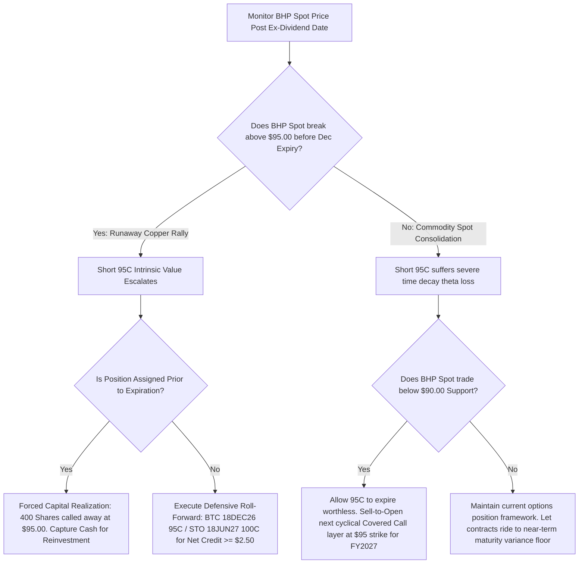

## 1. Current Price & Prospects

* Latest Market Price: $92.71 USD (NYSE) / $62.25 AUD (ASX).
* 52-Week Range: $51.83 – $98.71 USD.
* Short-to-Medium-Term Prospects: BHP Group Ltd is exhibiting robust cyclical resilience. The firm's operational focus has successfully pivoted toward energy-transition metals, shielding total revenue streams from systemic weakness in Chinese infrastructure and real estate iron ore pipelines.
* Core Catalysts:
* Copper Volume & Pricing Power: Structural secular demand driven by global electrification, data center expansions, and electric vehicle architectures provides structural support to operating cash flows.
   * Shareholder Payout Resiliency: Following FY2026 results (NPAT up 30% YoY to $13.2B USD), management demonstrated a strong fiduciary commitment by declaring a $0.99 USD final dividend, yielding a 72% payout ratio that outpaces diversified mining peers.

------------------------------
## 2. Current Holdings & Past Trades## Active Portfolio Exposures## Equities (Stocks)

* BHP (Primary Account - IBKR): 1,200 shares. Cost basis: $35.1022 USD. Current valuation: $112,704.00 USD. Unrealized P&L: +$70,581.33 USD (Capital gains of 167.56%). Original capital exposure has been dramatically de-risked via multi-year distributions.

## Derivatives (Options Contracts)

* BHP 18DEC26 95.00 C (IBKR): Short 4 contracts (-4.00 Qty). Execution premium captured: $4.0005 USD. Current contract price: $6.0500 USD. Unrealized P&L: -$820.00 USD. This covered call overlay is currently under immediate delta and gamma pressure as spot tracks within 2.4% of the strike.

## Historical Transaction Ledger Summary
An audit of historical transactions validates an exceptional long-term accumulation and compounding campaign:

* Capital Recovery Metrics: Total cash flow generated via multi-currency distributions over the holding duration stands at +$39,502.30 USD. Cumulative net dividends have successfully recaptured 93.78% of the initial capital deployed.
* Aggregated Portfolio Return Metrics: Combining equity appreciation, net options premiums captured, and historical dividend receipts net of foreign withholding taxes, the total realized and unrealized economic return on deployed capital sits at 259.39% (Annualized XIRR of 16.24%).

------------------------------
## 3. Recommended Actions## Core Directive: HOLD Equities / ACTIVE RISK MANAGEMENT on Derivative Overlays
Original base equity positions should be firmly held to capture the high-yielding structural baseline cash flow. However, immediate defensive risk-mitigation steps are mandated for the derivative layer to insulate the underlying stock from involuntary capital realization (forced assignment).
## Defensive Option Management: Tactical Roll Over
The short 18DEC26 95.00 Call layer is structurally vulnerable. To prevent 400 shares from being called away at a price below long-term fair value, capitalize on immediate post-ex-dividend spot softening to execute a defensive roll. Buy-to-Close (BTC) the 18DEC26 95.00 C and simultaneously Sell-to-Open (STO) the 18JUN27 100.00 C. This elevates your upside capital appreciation cap by 5.2% while securing net premium yield.
## Tax Optimization Context
As a confirmed Hong Kong tax resident, you trigger a 0% corporate/personal capital gains tax and 0% domestic tax on foreign-sourced income. However, US-sourced distributions face a mandatory 30% withholding tax at source. Defensive option positioning should prioritize capturing out-of-the-money capital appreciation up to the $100 strike over high-yielding call premiums, as capital appreciation remains completely tax-exempt under your jurisdiction.
------------------------------
## 4. Map of Execution Details## Execution Steps & Order Matrix

| Order Sequencing | Position Layer | Order Type | Target Execution Threshold | Tactical Objective / Rationale | Emergency Stop-Loss / Exit |
|---|---|---|---|---|---|
| Step 1 (Immediate) | 18DEC26 95.00 C | Buy-to-Close (BTC) | $5.80 USD or lower | Close out vulnerable short leg during any morning ex-dividend spot price pullback. | N/A - Closing Order |
| Step 2 (Simultaneous) | 18JUN27 100.00 C | Sell-to-Open (STO) | $8.30 USD or higher | Complete defensive time-and-strike roll; lock in minimum Net Credit of +$2.50 USD. | Stop-Loss on Contract: Close if option reaches $12.50 on runaway spot rally. |
| Step 3 (Conditional) | Core Equity Base | Good-Til-Canceled (GTC) Limit | $98.50 USD | Supply-side take-profit target for 200 shares if macro copper curves spike into 52-week highs. | Trailing Stop-Loss: Protect downside at $82.00 USD if iron ore market structurally breaks. |

## Decision-Tree Execution Flowchart

------------------------------
## Fiduciary & Analytical Disclaimer
This summary report constitutes general investment analysis for educational and auditing purposes based strictly on provided documentation. It does not consider individual localized liquidity requirements, specific multi-broker balance constraints, or broader asset class correlation dependencies outside of the verified data environment.

