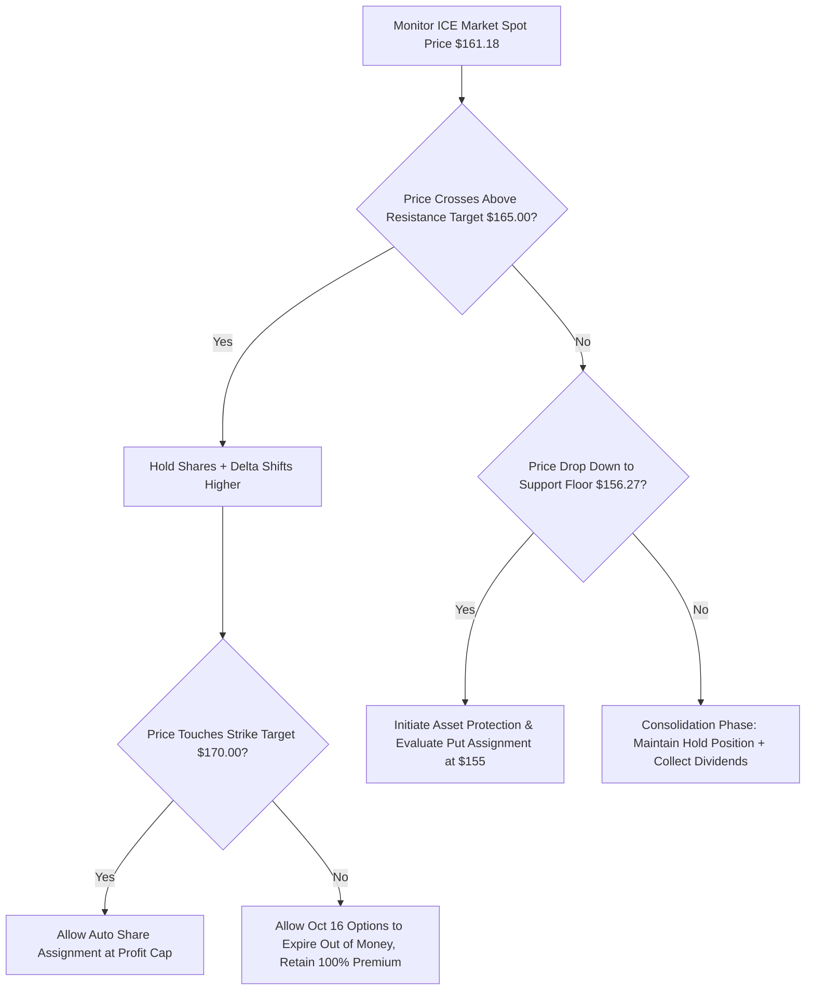

## 1. Current Price & Prospects

* Market Price & Trading Metrics: Intercontinental Exchange Inc. (NYSE: ICE) is trading at $161.18 USD (+2.11% intraday velocity). This sits within a premium 52-week trading channel bounded by an absolute cyclical low of $121.79 USD and a structural peak of $176.59 USD. Market capitalization scales at $90.49 Billion USD.
* Valuation Multiple Compression: The equity prints a trailing Price-to-Earnings (P/E) ratio of 22.76x (normalized calculation at 19.45x). While this reflects a historic sector premium compared to direct peer operators, current metrics are balanced by secular margin expansion across non-transactional business blocks.
* Near-to-Medium Term Catalysts:
* Inorganic Synergy Scale: The structural integration of the pending $6.0 Billion acquisition of MarketAxess acts as a near-term growth engine. Fiduciary modeling projects up to $100 Million in run-rate annualized operational synergies over a 24-month horizon.
   * Operational Volume Windfalls: Fresh structural ADV data highlights a 14% YoY surge in total Average Daily Volume (ADV). Pacing is driven by a 13% expansion in benchmark Energy contracts and a 92% YoY spike in Agriculture & Metals volume, insulating near-term EPS targets ahead of the Q3 disclosure scheduled for October 29, 2026.
   * Alternative Market Penetration: The $600 Million seed deployment into Polymarket provides unique institutional architecture exposure to high-velocity prediction market derivatives.

------------------------------
## 2. Current Holdings & Past Trades
Asset allocations are verified exclusively against active accounting records and clearing ledger databases.
## Active Capital Inventory

* Equities (Stocks): Long position of 300 core shares housed within the prime IBKR custody account infrastructure. The baseline structural cost basis sits at $155.00 USD per share (Gross deployed capital: $46,500.00 USD). Active market market-to-market value is pinned at $48,354.00 USD, presenting a net unrealized capital appreciation profit of +$1,854.00 USD (+3.99%).
* Derivatives (Options Contracts): There are no active or open options overlays currently applied against this position equity layer.

## Historical Realized Performance Ledger
The performance track record reflects an optimized alpha generation framework using tactical option premiums to cushion cash flows:

* Assignment Entry Structure: Deployed capital was initialized via cash-secured short puts (ICE 17JAN25 155 P), capturing +$855.00 USD in net option premium and forcing physical underlying equity assignment at an optimized entry floor of $155.00 USD.
* Yield Harvesting Overlays: Executed covered calls (ICE 17APR26 180 C) generated +$378.00 USD before expiring fully out-of-the-money, protecting capital gains.
* Distribution Returns: Accumulated historical distributions netted +$1,024.80 USD after factoring in source 30% US dividend withholding taxes. Total realized strategy outperformance beats a passive underlying buy-and-hold benchmark strategy by +4.85% in absolute economic return.

------------------------------
## 3. Recommended Actions
Fiduciary financial advisor mandate dictates a HOLD / CONSERVATIVE COVERED OVERLAY ADJUSTMENT stance. Capital commitments remain optimized; immediate additions are restricted due to near-term multiple inflation.
## 📢 Directives for Capital Optimization

   1. Maintain Baseline Stock Core Inventory: Hold all 300 core long shares intact. Do not trim underlying equity allocations at current levels; structural operational volume trends confirm significant revenue backstops into Q3 earnings.
   2. Deploy Pre-Earnings Covered Call Overlay: With active options layers completely vacant, immediate tactical deployment of covered calls is required. Capitalize on short-term technical resistance at $161.51 to lay an absolute profit ceiling that leaves an open runway for asset appreciation while mitigating source distribution tax drag.
   3. Capture Upcoming Dividend Distribution: Maintain position matching through the upcoming September 16, 2026 ex-dividend threshold to secure the announced $0.52 per share cash distribution.

------------------------------
## 4. Map of Execution Details## Operational Order Parameters
Execution parameters must strictly adhere to the following designated pricing boundaries and order guidelines:

| Action Trigger Phase | Specific Instrument Target | Execution Threshold / Limit Parameters | Stop-Loss / Protection Bound | Portfolio Optimization Rationale |
|---|---|---|---|---|
| Immediate Overlay Capture | Short 3x ICE Oct 16 '26 $170 covered call contracts. | Set structural Limit Order at $1.25 USD or better per contract block. | Set mental structural stop at $168.50 spot price for contract buy-back. | Captures out-of-the-money premium window; caps maximal capital appreciation upside at an absolute threshold of $170 (+5.47% from spot). |
| Tactical Accumulation | Short 1x ICE Oct 16 '26 $155 cash-secured put contract. | Set structural Limit Order at $1.80 USD or matching premium sweep. | None. Triggers target physical assignment. | Leverages a $15,500 USD margin lock to establish an accumulation buy-trigger at your primary institutional cost floor. |

## Decision-Tree Execution Map

