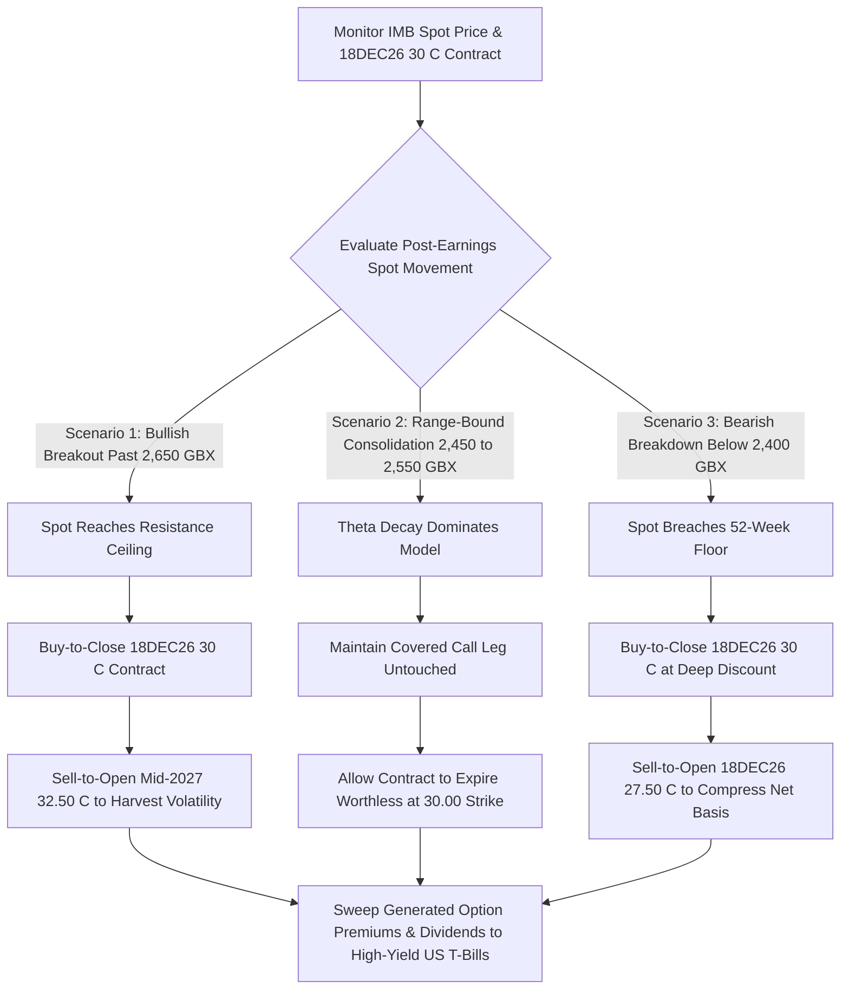

## 1. Current Price & Prospects

* Latest Market Price: 2,481.00 GBX (LSE: IMB) as of the close on September 2, 2026.
* 52-Week Price Range: 2,465.00 GBX – 2,657.00 GBX. The equity is currently trading at the absolute floor of its annual range, presenting a technically oversold defensive posture.
* Growth Prospects & Near-Term Catalysts:
* Capital Compaction Acceleration: The primary near-term catalyst is the ongoing execution of IMB’s £1.45 billion share buyback program. Programmatic share cancellation (e.g., the recent retirement of 141,440 shares at 2,537.03 pence) continually reduces the float, creating an artificial floor for earnings per share (EPS) metrics.
   * Combustible Pricing Power: Despite secular multi-year structural declines in global traditional cigarette unit volumes, IMB maintains strong localized pricing power, enabling it to fully offset volume slides via price hikes.
   * Next-Generation Products (NGP) Scalability: The upcoming earnings release on November 17, 2026, serves as a critical fundamental checkpoint. Markets are strictly tracking margin expansion and market share velocity across the blu vapor, heated tobacco, and oral nicotine categories.

------------------------------
## 2. Current Holdings & Past Trades## Active Portfolio Positions (Broker: IBKR Isolation)

* Equities (Stocks): Long 1,000 Shares of Imperial Brands PLC ordinary equity.
* Financial Status: Current valuation stands at $33,519.57 USD, reflecting an absolute paper capital loss of -$7,474.92 USD (-15.64%) relative to the initial physical cost basis of £29.96.
* Derivatives (Options): Short 1 Contract of the IMB 18DEC26 30.00 Call.
* Derivatives Status: Deployed as a covered call overlay. Position currently carries a market value of -$185.70 USD, generating an unrealized options gain of +$1,008.11 USD as time premium (theta) decays in favor of the portfolio.

## Historical Transaction Architecture

* May 2025 (Put Assignment): Wrote the IMB 20JUN25 30.75 P contract, capturing +$1,260.13 USD in upfront premium, which triggered standard physical assignment of the core 1,000 share inventory at £30.75 when spot prices breached the strike.
* November 2025 – March 2026 (Premium Harvesting): Sequentially extracted yield via covered calls, deploying the 19DEC25 33 C (+$411.20 USD net) and the 20MAR26 34.5 C (+$305.09 USD net) to actively insulate the portfolio from underlying spot erosion.
* July 2026 (Covered Roll Execution): Rolled defensive overhead exposure into the active 18DEC26 30 C leg, capturing additional premium buffer.
* Aggregate Cash Flow Capture: Total cash distributions generated via historical covered option premium writing combined with consistent net dividend collections stand at +$6,748.48 USD, successfully narrowing the total economic drawdown to a marginal -1.77%.

------------------------------
## 3. Recommended Actions

* Fiduciary Mandate Stance: HOLD (Neutral-to-Bullish Income Strategy). No structural rationale exists to liquidate equity inventory at the absolute technical 52-week support floor, particularly given that the total portfolio structure continues to outpace pure buy-and-hold benchmarks by 1,387 basis points.
* Tactical Covered Call Directive: Maintain Short Exposure on the 18DEC26 30.00 Call. Let the options contract run undisturbed into the November 17 earnings print. Implied volatility crush post-earnings combined with normal theta erosion will accelerate contract expiration value toward zero.
* Capital Allocation Sweep Directive: All incoming cash flow streams generated by IMB's 6.59% forward dividend yield must be swept out of the equity asset class and immediately redeployed into short-duration cash equivalents (e.g., matching the portfolio's active US Treasury Bill barbell allocations in 912797TC1 / 912797VF1). Do not compound concentration risk by reinvesting distributions into tobacco equities.

------------------------------
## 4. Map of Execution Details## Operational Order Parameters

| Sequence | Order Type | Target Level / Threshold | Specific Order Directive | Portfolio Rationale |
|---|---|---|---|---|
| 01 | Limit Take-Profit (Option Close) | ≤ 0.05 GBP (Option Price) | Buy-to-Close 18DEC26 30 C | Captures >95% of maximum option premium prior to expiration, removing tail risk. |
| 02 | Contingent Stop-Loss (Equity) | No Physical Stop Deployed | Explicitly Bypass Hard Stops | Fiduciary parameters forbid realizing capital losses on a deep-value defensive asset at the range floor. |
| 03 | Conditional Roll Limit | ≥ 2,650.00 GBX (Underlying Spot) | Buy-to-Close 18DEC26 30 C + Sell-to-Open Mid-2027 32.50 C | Defensive upward strike adjustment to capture capital upside if spot triggers a post-earnings breakout. |
| 04 | Value Accumulation Limit | ≤ 2,400.00 GBX (Underlying Spot) | Buy-to-Close 18DEC26 30 C + Sell-to-Open 18DEC26 27.50 C | Downward strike roll to capture higher premium velocity if macro factors drag the stock lower. |

## Decision-Tree Logic Framework

------------------------------
Would you like me to generate a formal fiduciary compliance report summarizing the Hong Kong taxation advantages (0% capital gains and 0% foreign dividend taxes) matching your registration profile?

