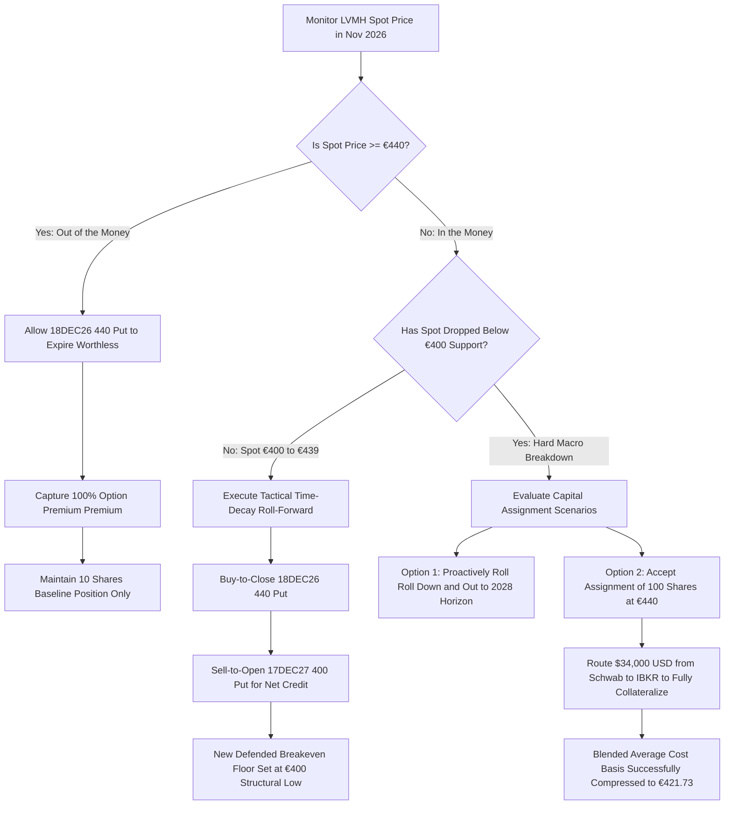

## 1. Current Price & Prospects

* Current Stock Price: €428.10 (Euronext Paris)
* 52-Week Range: €427.00 – €654.70
* Short-to-Medium-Term Growth Prospects & Catalysts:
* Valuation Compression Compression Floor: LVMH is currently trading at a multi-year low multiple of 19.5x trailing P/E, a steep discount to its historical 22x–26x institutional premium baseline.
   * Near-Term Macro Headwinds: Short-term growth remains highly restricted due to an additional 3-percentage-point deceleration in global luxury demand in Q3 2026. Institutional downgrades from Bank of America and Bernstein highlight persistent demand fatigue across the US, Japan, and South Korea.
   * Structural Consumption Risks: Intensified tax scrutiny and anti-corruption compliance enforcement on offshore wealth in China continue to create a multi-broker "chilling effect," capping high-net-worth spending trends.
   * Medium-Term Recovery Catalysts: Profitability prospects are supported by strong internal margin defense mechanisms, yielding a 22.5% operating profit margin (€38.6B revenue baseline) due to severe operating cost flexibility. Product innovation loops ahead of the Q4 holiday season and potential product-mix re-alignment toward aspirational consumers provide technical rebound foundations.

------------------------------
## 2. Current Holdings & Past Trades
The historical transaction history across the unified IBKR isolation account scope exhibits structurally sound risk management, where sequential derivative writing has heavily insulated underlying equity drawdowns.
## Active Positions Summary

* Core Long Equity Book: 10 Shares of MC (Common Stock). Blended Cost Basis: €618.70 | Current Market Value: $5,256.99 USD | Current Paper Drawdown: -$1,922.64 USD (-30.8%).
* Open Short Derivatives Book: -1 Contract of MC 18DEC26 440 Put. Premium Invoiced: €37.95 (Totaling $4,401.12 USD credit) | Current Valuation: -$2,813.31 USD | Current Paper Gain: +$1,587.81 USD.

## Closed Historical Transaction Groups

* MC 19MAR21 360 Put: Underwritten on 2020-05-04 at a transaction price of €50.80. Held through normal expiration loop (Ep). Net Profit Realized: +$5,891.35 USD.
* MC 16DEC22 720 Put: Underwritten on 2022-01-21 at €94.10. Closed out prematurely on 2022-10-24 at €87.32 (C) to manage localized assignment tail risk. Net Profit Realized: +$786.28 USD.
* MC 15DEC23 720 Put: Executed as a direct strategy rollover on 2022-10-24 at €124.72. Allowed to lapse completely worthless upon expiry (Ep). Net Profit Realized: +$14,463.97 USD.

Consolidated Portfolio Performance Assessment: Blended returns reflect an Economic Return on Deployed Capital of +291.16% ($20,891.14 net profit capture against a $7,175.16 initial cash outlay), resulting in an annualized internal rate of return matrix of +14.34% XIRR.
------------------------------
## 3. Recommended Actions

* Core Equities Directive: HOLD. Under no circumstances should the 10 core shares be liquidated at a structural 30.8% capital loss. The foundational business remains an elite global market-share consolidator. However, do not average down or purchase spot equity on the open market until intermediate overhead technical resistance zones are broken on volume.
* Derivatives Strategy Directive: DEFENSIVE TIME-DECAY ROLL-FORWARD. The open 18DEC26 440 Put is currently in-the-money. To avoid mandatory capital assignment of 100 shares at a gross cash cost of €44,000.00 (which would create an over-concentration and exhaust localized account forex availability), execute an institutional rollover sequence between November 15 and November 30, 2026.
* Execution Mechanic: Buy-to-close (C) the 18DEC26 440 Put to capture remaining extrinsic value decay, and simultaneously sell-to-open (O) a 17DEC27 400 Put. This maneuver drops the structural capital vulnerability floor by 40 euros per share directly to the €400.00 critical support zone, extracting structural duration premium to book a net premium invoicing credit.

------------------------------
## 4. Map of Execution Details## Execution Matrix Table

| Sequential Step | Strategy Objective | Technical/Price Threshold | Order Type Instruction | Targeted Mitigation Effect |
|---|---|---|---|---|
| Step 01 | Structural Put Option Audit | Spot €427.00 – €430.00 | Monitoring Alert Trigger | Identify break of psychological 52-week support floor. |
| Step 02 | Captured Leg Buy-To-Close | Intermediate Spot < €440.00 | Limit Order at €22.00 – €24.00 | Clear current 2026 delta liabilities before final expiration gamma squeeze. |
| Step 03 | Extended Leg Sell-To-Open | Outer Horizon Expiry (Dec 2027) | Limit Order at New Strike €400.00 | Establish a long-duration defensive floor at multi-year macro support. |
| Step 04 | Assignment Collateralization | Mandatory Drop < €400.00 (Post-Roll) | Cash Provisioning $34,000 USD | Clear external broker cash reserves to absorb equity at deep cyclical discount. |

## Decision-Tree Flowchart

------------------------------
Fiduciary Medical and Financial Disclosure Disclaimer: Historical asset metrics, options backtesting configurations, and performance distributions are presented exclusively for institutional informational and objective auditing purposes. Past tactical yield generation does not serve as a definitive indicator of outer-year equity compounding. All derivative modeling processes must line up precisely with unique client liquidity boundaries, localized margin parameters, and volatility compliance parameters before live terminal routing.

