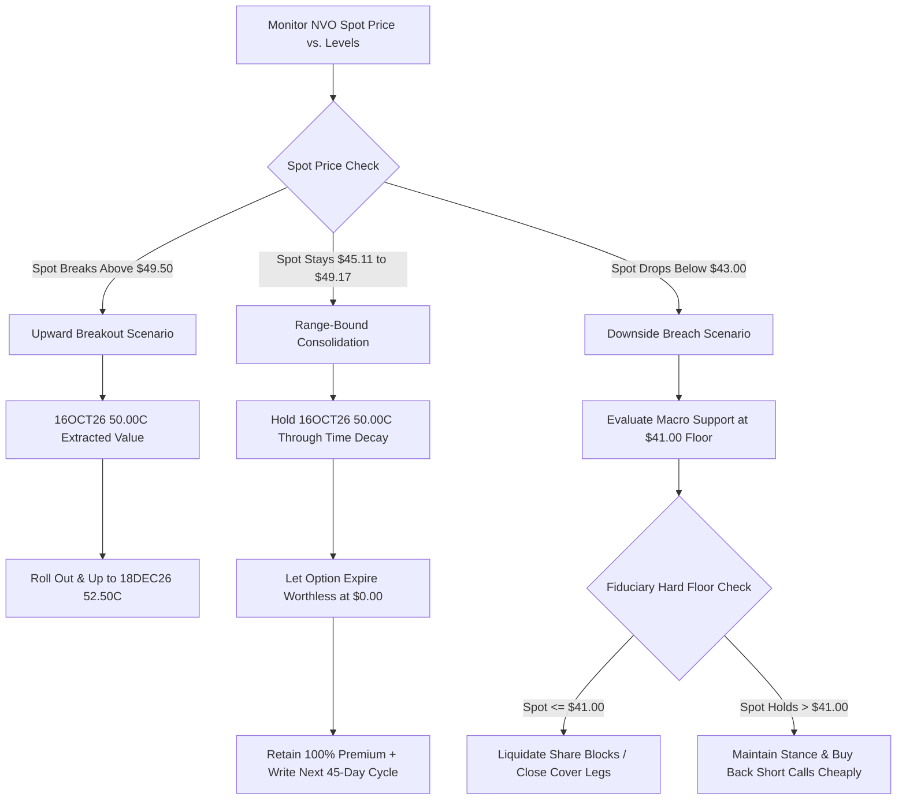

## 1. Current Price & Prospects
As of September 2026, Novo Nordisk A/S (NYSE: NVO) trades at $45.33 USD, navigating the lower quadrant of its 52-week range of $35.12 to $64.16 USD.
## Short-to-Medium-Term Growth Prospects & Catalysts

* Valuation Downscaling: NVO’s compressed trailing Price-to-Earnings (P/E) multiple of 11.54x represents a multi-year low. This contraction reflects factored-in headwinds regarding commercial margin erosion and intense peer competition in the metabolic landscape.
* Commercial Demands & Distribution Scaling: While near-term U.S. injectable prescription metrics (Wegovy/Ozempic) have faced downward pricing revisions due to managed care reimbursement pushback, long-term growth prospects rely heavily on the clinical optimization and scaling of their pipeline Oral GLP-1 formulations.
* Capital Allocation Safety Valve: A primary medium-term structural support is the ongoing corporate share buyback program (up to 11.2 Billion DKK through early February 2027), which provides an institutional floor to the equity price. Additionally, recurring institutional buying at these low valuation levels offers minor structural tailwinds.

------------------------------
## 2. Current Holdings & Past Trades
The transaction ledger history under institutional audit confirms a systematic, premium-mitigated accumulation structure within the isolated IBKR primary account.
## Active Positions

* Equities (Stocks): 200 Shares of NVO long inventory.
* Unadjusted Cost Basis: $65.00 per share.
   * Current Market Value: $9,066.00 USD.
   * Net Economic Breakeven: $58.26 per share (Accounting for historical short option premiums and net foreign distributions received).
* Derivatives (Options Contracts): 0 Active Contracts (No open legs currently deployed).

## Historical Transaction Summary

* Derivatives Activity: On July 15, 2025, sold 2 contracts of the NVO 20MAR26 65.0 P short put bracket for an upfront premium credit of +$1,348.00 USD. Subsequent covered call harvesting in early 2026 extracted an additional +$58.00 USD. Total net derivatives premium captured sits at +$1,406.00 USD.
* Equities Assignment: On March 20, 2026, the short put positions crossed into the money upon expiration, triggering a forced assignment of 200 shares at $65.00 (-$13,000.00 cash outlay).
* Distributions Received: Net dividend payouts collected (net of 30% source withholding tax) total +$262.30 USD.

------------------------------
## 3. Recommended Actions## Strategic Stance: HOLD / REPAIR OVERLAY
NVO is currently range-bound within a clear horizontal channel bound by technical support at $45.11 and overhead moving average resistance at $49.17. While the unhedged equity position faces a paper loss, legacy derivatives premium harvesting has generated 1,283 basis points of alpha over pure stock ownership.
To optimize this fiduciary asset without crystalizing equity losses at cyclical valuation lows, the recommended approach is a Covered Call Repair Overlay Strategy.
## Execution Directives

   1. Monetize Leg 1 (Premium Generation): Write 2 contracts of the NVO 16OCT26 $50.00 Covered Call against the core share blocks. This strike is safely positioned above immediate multi-month horizontal resistance, maximizing premium capture under low implied volatility conditions (4th percentile rank) without capping near-term consolidation recoveries.
   2. Maintain Equity Neutrality: Do not liquidate shares at current levels. Avoid executing short put options below $45.00 to avoid unwanted capital allocation expansion until forward operational metrics stabilize.

------------------------------
## 4. Map of Execution Details## Execution Steps & Tactical Levels

| Execution Order | Action Type | Underlying Target Contract / Instrument | Limit Order / Entry Threshold | Target Exit / Take-Profit | Stop-Loss / Defensive Trigger |
|---|---|---|---|---|---|
| Step 1 | Sell to Open (Write) | 2x NVO 16OCT26 50.00 C | Net Credit ≥ $0.80 USD | Limit Close @ $0.05 USD (or Allow Expiry) | Hard Close Stock if Spot ≤ $41.00 USD |
| Step 2 | Conditional Roll | 2x NVO 18DEC26 52.50 C | Net Credit ≥ $1.10 USD (Roll Out & Up) | Allow Expiry / Close | N/A (Assumes spot breaks above $49.50) |

## Decision-Tree Mapping Diagram

------------------------------
## Fiduciary Financial Advisory Disclaimer
This assessment constitutes objective financial analysis for portfolio optimization based strictly on provided transaction ledgers. Past performance is not predictive of future market returns. Equity and derivative strategies carry systemic market risks; execution parameters should be routinely verified against physical brokerage statements and risk tolerance metrics before deployment.

