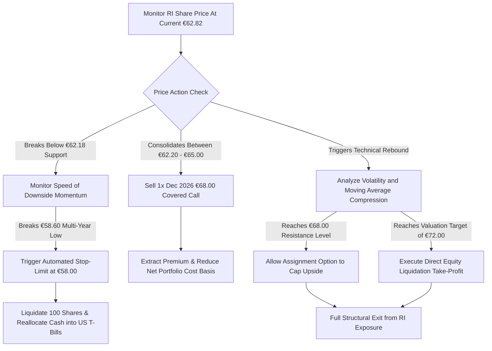

## 1. Current Price & Prospects

* Market Price: €62.82 (as of close September 2, 2026).
* 52-Week Range: €58.60 – €100.55.
* Short-to-Medium-Term Prospects & Catalysts:
* Cyclical De-premiumization Engine: Short-to-medium-term prospects remain fundamentally impaired. Multi-year post-pandemic structural headwinds are driving sharp sales corrections across high-margin premium spirit segments.
   * Core Market Contraction: FY26 organic sales drop heavily reflects a 14% collapse in the United States and a 19% downturn in China, signaling long-term macroeconomic adjustments in luxury consumer spending patterns.
   * Strategic Margin Defenses: Operational catalysts are limited to internal optimizations. The group has accelerated its €1 billion operational restructuring initiative to preserve operating margins (currently at 25.8%). Concurrently, regional pockets like India (+7% organic growth) provide a long-term emerging-market diversification hedge.

## 2. Current Holdings & Past Trades## Equities (Stocks)

* Current Active Position: 100 shares of Pernod Ricard SA (RI) held in the primary Interactive Brokers (IBKR) account.
* Cost Basis: €93.00 ($10,785.35 USD total deployed capital) settled on March 4, 2026.
* Mark-to-Market Valuation: $7,480.16 USD, reflecting a nominal capital loss of -$3,305.19 USD.
* Historical Returns: Net economic return stands at -29.15% (inclusive of +$204.40 USD net dividend capture and -$43.14 USD execution charges). Pure stock capital return is -30.65%.

## Derivatives (Options Contracts)

* Past Trade Execution: 1x Short Put Option Contract (Strike: €93.00, Expiry: 20MAR26) expired in-the-money, resulting in a mandatory purchase assignment of the underlying 100 equity shares on March 4, 2026.
* Current Exposure: 0% options coverage. The portfolio currently holds no derivatives, leaving the underlying long equity position fully exposed to directional downside risk.

## 3. Recommended Actions## Direct Position Stance: HOLD / BEARISH CALL OVERLAY

* Long Equity Directive: Do Not Capitalize / Do Not Average Down. Initiating additional capital exposure to lower the average cost basis is strongly discouraged. The underlying asset exhibits net debt leverage of 3.7x EBITDA, creating material balance-sheet risk and threatening the safety of the current inflated forward dividend yield.
* Derivative Hedge Overlay: Deploy Defensive Premium Harvesting. Given that the allocation represents an insulated 0.28% portfolio weight, liquidating at historic technical lows locks in capital inefficiency. The fiduciary recommendation is to execute a Covered Call Strategy to generate systematic income, exploit high compressed implied volatility, and offset structural price deterioration.

## 4. Map of Execution Details## Execution Matrix Table

| Order Phase | Order Type | Underlying Strike / Target | Limit Order / Premium Threshold | Stop-Loss / Stop-Limit Trigger | Conditional Execution Objective |
|---|---|---|---|---|---|
| Primary Hedging Overlay | Sell to Open Covered Call | €68.00 Strike (Dec 2026 Expiry) | Limit Price $\ge$ €1.85 per contract | Buy-to-Close Stop at $\ge$ €4.50 | Captures upfront income and structures a immediate defensive ceiling around current 20-day moving average. |
| Secondary Downside Filter | Sell Stop-Limit Stock Order | €58.00 Structural Level | Limit Trigger: €58.00 / Execution Limit: €57.75 | N/A | Automated portfolio protection to completely neutralize systemic drawdown risks if structural support fails. |
| Upside Capital Re-capture | Sell to Close Stock Order | €72.00 Valuation Target | Limit Price $\ge$ €72.00 | N/A | Take-profit mechanism to fully exit the position upon a technical rebound to normalized P/E averages. |

## Conditional Decision-Tree Flowchart

------------------------------
If you want me to generate the exact option order ticket strings or calculate the exact premium values required to hit your targeted cost-reduction metric inside your IBKR workstation, please let me know.

